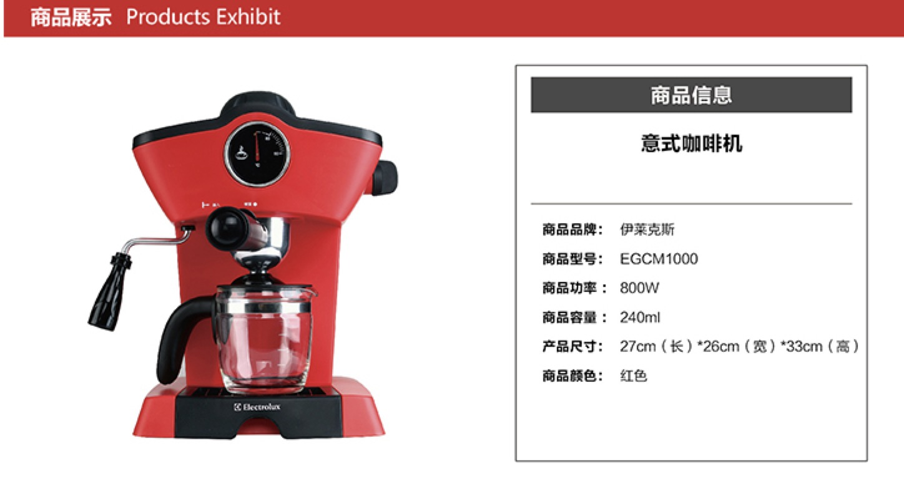

# 编程小游戏

## 题目要求

玩家根据要求, 构建一定数目的线程

每个线程只能打印``A``-``Z``中的一个字母

在一定时间内, 所有线程开启, 最后打印出有序的字母集


## sample

线程数:3
循环次数: 3

输出
```
ABCABCABC
```

线程数:4
循环次数: 2

输出
```
ABCDABCD
```


线程数:10
循环次数: 4

输出
```
ABCDEFGHIJABCDEFGHIJABCDEFGHIJABCDEFGHIJ
```


## 规则介绍

玩家在该项目下, 拉出自己的分支, 做开发

要求玩家实现自己的MyThread, 以及MyThreadBuilder

其中MyThreadBuilder的入参已经限制好:

```java
/**
     * 构建你的线程们
     *
     * @param threadCnt 线程总个数
     * @param stringBuffer 打印到此流中
     * @param printTimes 打印总次数
     * @return
     */
    public static MyThread[] build(int threadCnt, StringBuffer stringBuffer, int printTimes, CountDownLatch countDownLatch) {

        //todo create your own threads

        return null;
    }
```

其中``threadCnt``表示要求构建的线程总数

``stringBuffer ``是最终输出统一的buffer

``printTimes ``表示需要打印的次数

## 限定

玩家可以使用jdk所有功能以及google的guava包, 在离网环境下, 
做编程

## hint

```java
synchronized, volatile

ReentrantLock, CyclicBarrier, CountDownLatch

wait, notify, notifyAll
```

## 胜利判定

* 1.程序能完成功能, 能跑过所有测试用例
* 2.在1完成的情况下, 在循环执行一定次数的情况下, 用时最短的玩家获胜
* 3.code review, 虽然能完成功能, 是否符合要求


## 奖励

### ``winner winner chicken dinner!``: 咖啡机
 

### ``Thread Keeper``: 胡桃木小音箱
 


### ``思路新奇``: 星巴克会员卡一张
 